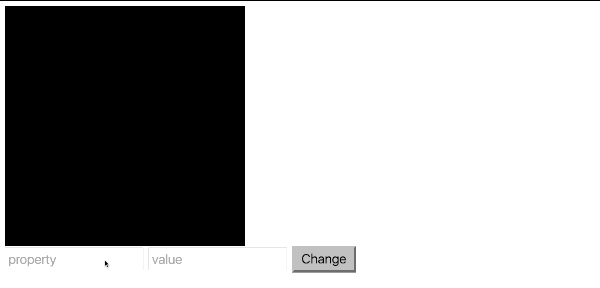

## DOM и не только.

### Release 0

У тебя есть папка `project`. Выполни следующие задания:
- Добавь поле ввода с `id="very-important-message"` вместе с кнопкой. Когда пользователь нажимает кнопку, внутри элемента с классом "box" должен появиться текст из поля ввода.
- Добавь 2 поля ввода: одно - для CSS-свойства, второе - для его значения. Когда пользователь нажимает на кнопку, элемент с классом "box" должен получить стиль, в соответствии с введёнными данными.

