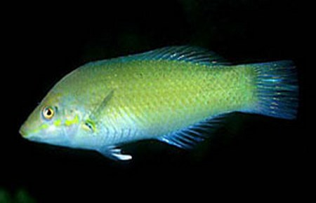
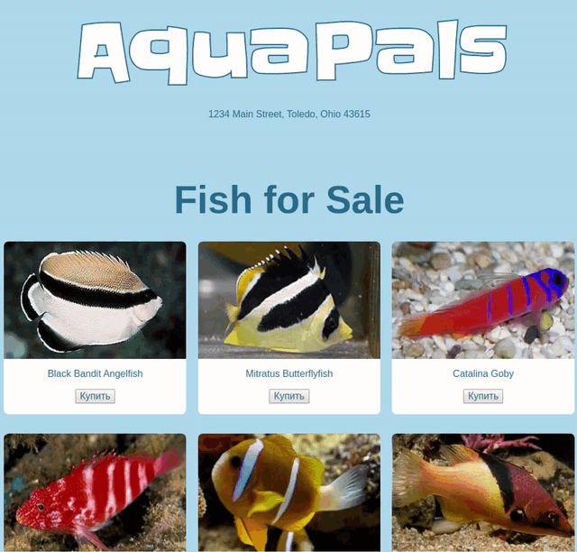

## DOM. Начало.

Каждый раз, когда мы посещаем веб-страницу, наш браузер сначала отправляет запрос на сервер, запрашивая контент, и сервер отправляет в ответ страницу с HTML-разметкой.

HTML в ответе сервера - это просто текст. Но когда браузер получает ответ, он анализирует этот текст и создает набор объектов на основе полученного текста. Каждый объект представляет собой один элемент HTML, и они связаны друг с другом в древовидной структуре, представляющей текст HTML.

Этот набор объектов известен как  *[Document Object Model](https://developer.mozilla.org/ru/docs/DOM/DOM_Reference)* (`Объектная модель документа`), или кратко - DOM.

Если перевернуть слова, то можно сказать, что DOM моделирует документ. Во время работы с DOM за основу принимается объект под названием `document`, представляющий собой «корневой узел» - узел, который является родительским элементом всех других узлов HTML внутри него.

Благодаря DOM, можно получить доступ к узлам с определенными классами, их дочерние узлы и многое другое. 

*Взаимодействие с DOM в браузере происходит с использованием JavaScript.*


`Release 0` содержит в себе теоретическую часть и работу в консоли. Идея в том, чтобы внимательно вчитаться и усвоить все, что написано ниже, а также попробовать поработать в консоли и посмотреть, как меняется твоя страничка. 

### Release 0: HTML, DOM и инструменты Dev

Чтобы начать изучение DOM, давай рассмотрим документ HTML и то, как он представляется в браузере. 
Открой в текстовом редакторе файл `index.html`, находящийся в текущем репозитории. Можно заметить, что это довольно простой html-документ. 

Начнем с тега `<html>`. Вложенными в тег `<html>` являются теги `<head>` и `<body>`. Затем в теге `<body>` вложены `<header>` и `<main>`. Прочитай файл полностью, чтобы понять структуру html-документа. Какие еще элементы существуют? Как они организованы?

После того, как ты поймёшь структуру документа, запусти `index.html` в браузере. Когда ты запускаешь файл, браузер получает текст документа, анализирует его и преобразует в DOM. Каждый элемент HTML преобразуется в объект DOM, а объекты DOM организуются в древовидную структуру "[дерево узлов](http://www.html5rocks.com/en/tutorials/internals/howbrowserswork/#DOM)".

Ты можешь исследовать дерево DOM с помощью [инструментов разработчика](https://developer.chrome.com/devtools) своего браузера. Если ты используешь браузер Chrome, то найти DOM ты сможешь во вкладке «Элементы». Древовидная структура DOM отображается как иерархический список, который ты можешь визуально исследовать, расширяя и сворачивая отдельные ветви. Когда твой курсор перемещается по узлу в списке, то этот узел выделяется в режиме просмотра страницы. Это показано на Рисунке 1.


*Рисунок 1*. Использование инструментов разработчика Chrome для исследования DOM.

### Release 0.1 : Извлечение информации из DOM

DOM представляет элементы HTML-документов в виде объектов. И, как ты знаешь, объекты предоставляют интерфейсы для взаимодействия с ними. Объекты DOM не являются исключением. В этом релизе тебе предстоит рассмотреть, как можно извлекать информацию из DOM.

Ты будешь работать в [консоли](https://developer.chrome.com/devtools#console) JavaScript браузера. Консоль - один из инструментов разработчика. В Chrome она доступена во вкладке «Консоль». В этой консоли ты можешь писать и выполнять JavaScript-код.

Доступ к DOM предоставляется через объект `document`. Что можно сделать с этим объектом? Это корень дерева DOM, и ты можешь запросить у него элемент с определенным идентификатором или классом.

Открой консоль в инструментах разработчика и попрактикуйся в получении некоторой информацию из DOM, как в примере ниже:

```javascript
// Получение объекта document
document;

// Получение заголовка страницы
document.title;

// Получение элемента с атрибутом id="fish-list"
document.getElementById("fish-list");

// Получение всех элементов <span>
document.getElementsByTagName("span");

// Получение всех элементов с классом "fish-list-card"
document.getElementsByClassName("fish-list-card");

// Получение всех элементов <h1>, находящихся внутри элемента с id="main"
let main = document.getElementById("main");
main.getElementsByTagName("h1");

// Получение всех дочерних элементов, находящихся в первом подходящем элементе с классом "fish-list-card"
let firstCard = document.getElementsByClassName("fish-list-card")[0];
firstCard.children;

// Получение текстового содержимого внутри элемента с id="wordmark"
let wordmark = document.getElementById("wordmark");
wordmark.innerText;
```

Теперь поработай с DOM самостоятельно. Получи в консоли ответы на следующие вопросы, связанные с DOM:

- Каков адрес, указанный на веб-странице?
- Как называется последняя рыба в списке?
- Каково значение атрибута `src` для картинки черного бандита-ангела?

### Release 0.2 : Обновление DOM

Объекты DOM также предоставляют методы для внесения изменений в DOM. Например, можно изменять текст, который появляется на странице, добавлять классы к объектам и т.д. Ты можешь даже создавать новые элементы и добавлять их в DOM. Продолжай работу в консоли со страницей `index.html`. Действуй согласно инструкциям ниже. По мере добавления кода в консоли, ты будешь видеть изменения в DOM, отраженные в просмотре страницы.

```javascript
// Изменение текста внутри элемента с id="wordmark")
let wordmark = document.getElementById("wordmark");
wordmark.innerText = "Aqua-Pets";

// Добавление класса "light" к элементу с id="wordmark")
wordmark.className += " light";

// Изменение текста внутри первого элемента <h1>, находящегося внутри элемента с id="main")
let main = document.getElementById("main");
let mainHeading = main.getElementsByTagName("h1")[0];
mainHeading.innerText = "Fish for $ale";

// Создание элемента <footer> и добавление его в конец элемента <body>
let footerText = document.createElement("span");
footerText.innerText = "AquaPals - 2016";
let footer = document.createElement("footer");
footer.id = "footer";
footer.className = "light flex-column";
footer.appendChild(footerText);
footer // Посмотри на элемент <footer>, который ты создал(а)
let body = document.getElementById("body");
body.appendChild(footer);

// Обнови стиль элемента <footer>)
footer.style.paddingTop = "6em";
footer.style.paddingBottom = "6em";
```

Прежде чем попробовать сделать какие-то изменения самостоятельно, обнови страницу. Что случилось с прошлыми изменениями? Они исчезли! Почему? Помни, когда страница загружается, браузер преобразует документ в DOM. DOM - это объект, который представляет HTML, но это не HTML. Когда ты редактируешь DOM, ты меняешь объекты только в дереве DOM. Но ты не редактируешь сам HTML-файл, из которого был создан DOM. При обновлении страницы, браузер повторно разбирает HTML-файл и создает новое дерево DOM.

Теперь пришло время обновить DOM самостоятельно. В консоли выполни следующие изменения:

- Измени название «Akindynos Clownfish» на «Clownfish».
- Добавь другую рыбу в список, используя только JavaScript (без редактирования файла HTML). Твоя новая рыба должна преобразоваться в следующий html-код:

  ```
  <li id="fish-9" class="fish-list-card flex-column light">
      
      <span class="fish-list-card-name">
        Green Wrasse
      </span>
  </li>
  ```

### Release 0.3 : Обработчики событий

Пользователи могут взаимодействовать с нашей страницей: нажимать на элементы, заполнять формы и т.д. К элементам, с которыми пользователи будут взаимодействовать, можно добавить обработчики (функции), которые будут вызваны при срабатывании определённого события (например, клика по кнопке).

Продолжай работать в консоли с `index.html`. Добавь несколько обработчиков событий, согласно коду ниже.

```javascript
// Определение функции, которая будет открываться в качестве предупреждения)
function alertWordmarkClick() { alert("You clicked the wordmark."); }

// Навешивание обработчика события, срабатывающего по клику на элементе с id="wordmark"
let wordmark = document.getElementById("wordmark");
wordmark.addEventListener("click", alertWordmarkClick);
```

Что делает обработчик, написанный выше? Попробуй написать еще один обработчик самостоятельно. Что будет происходить при срабатывании события?

### Release 1: Напишем свой скрипт

Ты поработал с `DOM` в консоли, теперь давай приблизимся на шаг ближе к реальной разработке. 
Напишите весь код в index.js файле. Не забудьте его подключить в html файле.

Наша задача сделать следующее:
- добавить кнопки `Купить` на каждую карточку
- навесить обработчик событий на кнопки
- по клику должно появляться окошо `alert` с именем рыбки на которую вы кликнули


