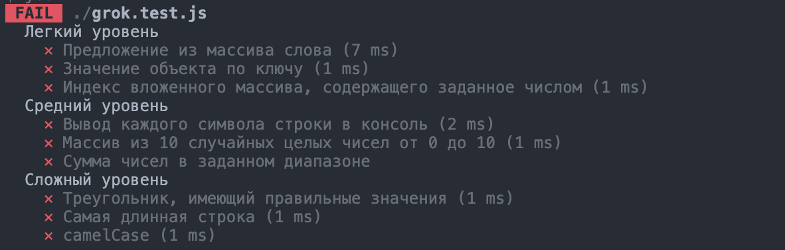
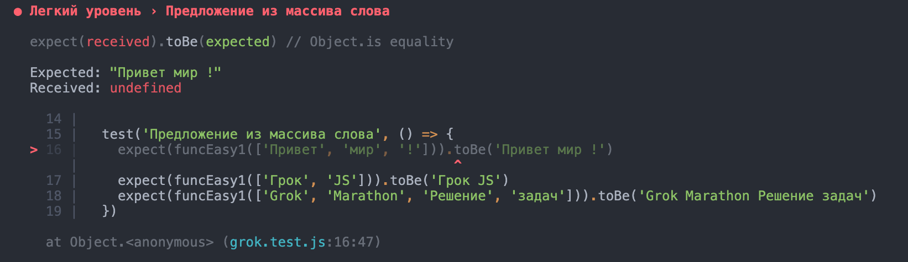

# grok-js-base 🐣

### Как с этим работать
В директории проекта находится 3 папки c упражнениями, разбитыми по сложности. В каждой папке три файла. Один файл - одно упражнение.  
  
#### Чтобы проверить себя, используйте тесты:
1. После того, как склонировали репозиторий, в папке проекта откройте консоль и выполните команду  `npm i`
2. После выполнения каждого упражнения запускайте тестирование с помощью команды `npm test`

#### Чтобы посмотреть какие тесты вы прошли, прокрутите консоль вверх:  
  
  

#### Чтобы узнать больше информации о не пройденном тесте, посмотрите:  
```  
Expected: что ожидал тест  
Received: что получилось у вас  
```  
  

### Release 0
Выполните легкие упражнения из папки **Easy**  

### Release 1
Выполните упражнения средней сложности из папки **Medium**  

### Release 2
Выполните сложные упражнения из папки **Hard**. В этих заданиях тебе нужно прописать аргументы функций самому.  

⚠️ Обратите внимание, когда будете пушить проект, что главная ветка в этом репозитории называется main, а не master.
