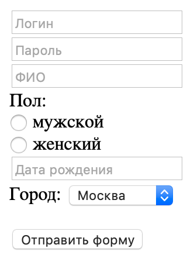

## Регистрация
Вероятно, тебе часто приходилось регистрироваться на различных сайтах. И почти всегда регистрация выглядит схожим образом. Тебя просят оставить логин, пароль, имя, почту и прочие данные о себе. Теперь ты можешь сделать такую форму регистрации самостоятельно, все намного проще, чем тебе кажется `:)`

Тебе пригодятся эти теги: `<a>`, `<form>`, `<input>`, `<label>`, `<select>`, `<option>`, `<button>`, `
`.

*Пример формы регистрации:*

### Релиз 0.
- Создай страницу `greetings.html` с поздравлением об успешной регистрации.
- Создай страницу `index.html`, внутри которой будет располагаться форма регистрации.

Наполни страницы заголовками и текстами по своему усмотрению. 
Добавь ссылки перехода между страницами.

### Релиз 1.
Сделай форму со следующими полями:

- Логин
- Пароль
- ФИО
- Пол
- Дата рождения

### Релиз 2.
Форма выглядит достаточно скучно. Давай добавим разнообразия и уникальности. Придумай самостоятельно несколько полей, которые ты хотел(а) бы видеть во время регистрации. При этом используй подсказки (`placeholder`), радиокнопки (`radio`), выпадающие списки (`select`).

### Релиз 3.
Теперь добавь кнопку отправки формы. При нажатии на эту кнопку пользователя должно перенаправлять на greetings.html. Не используй javascript для работы с кнопкой. Данная задача решается при помощи HTML.

*И наконец, не забудь сделать "Pull request" своего проекта прежде, чем приступать к следующему заданию.*
