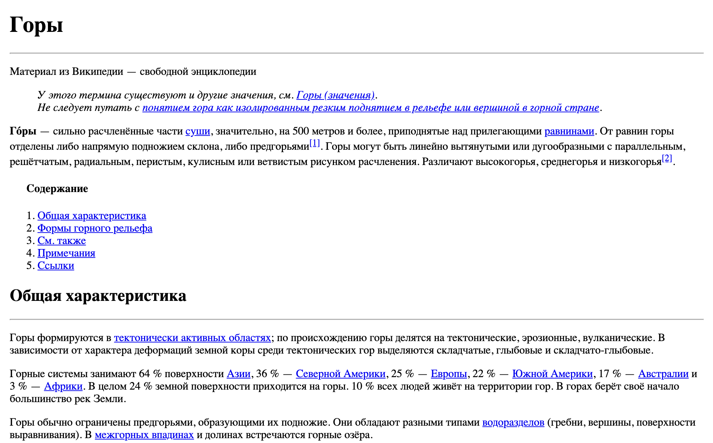

## Меню навигации.

Ты много раз сталкивался(ась) с меню навигации по html-странице. Вспомни, например, Википедию. В начале каждой статьи у тебя есть "содержание", каждый пункт которого является ссылкой на соответствующий раздел. При нажатии на ссылку страница прокручивается до нужного тебе раздела в статье. Скорее всего ты уже догадался(ась), что тебе предстоит сделать в этом задании - меню навигации по странице! То есть такое же оглавление с ссылками на разделы.

*Для выполнения задания тебе необходимо подробнее изучить работу ссылок `<a>` и познакомиться с так называемыми ["якорями"](http://htmlbook.ru/samhtml/yakorya).*

*Тебе могут пригодиться следующие теги:*
- `
`
- `<blockquote>`
- ` `
- `<strong>`
- `<em>`
- `<ins>`
- `<del>`
- `<cite>`
- ` / `

### Релиз 0.
Возьми любую статью из [Википедии](https://ru.wikipedia.org), в которой есть `Содержание`. Создай html-файл с Заголовками и текстом из выбранной ранее статьи. Результат сохрани в файл `index.html`.

### Релиз 1.
Теперь добавь в верхней части html-страницы меню навигации в виде списка, каждый пункт которого соответствует какому либо разделу html-страницы. При нажатии на пункт меню, пользователя должно перекидывать к соответствующему разделу.

### Релиз 2.
Статья уже работает! Однако она пустовата... Добавь стилистические составляющие (жирный / курсивный текст), сноски и ссылки на другие источники, изображениея и таблицы, которые есть в выбранной тобой статье на сайте Википедии.

Всё уже готово? Осталось только сделать "Pull request".
